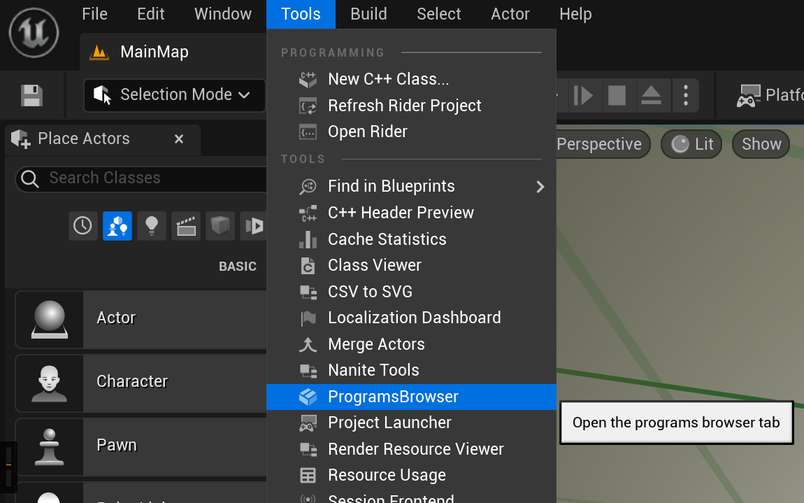
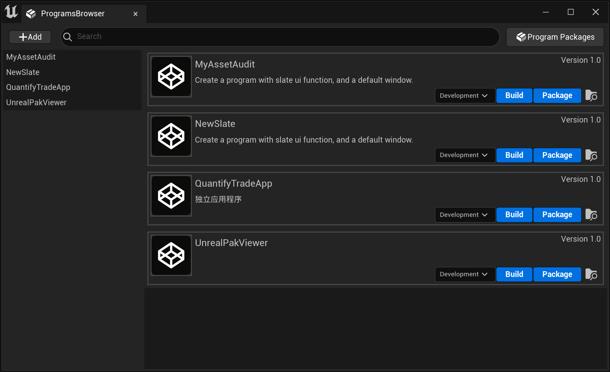

# UE ProgramBrowser

使用虚幻引擎（Unreal Engine）提供的资源创建独立应用程序（Standalone Program）而非游戏（Not Game），本插件实现了对独立应用程序从创建到打包的一键式流程管理

# 运行环境

- Unreal Engine 5.2.1 （源码版 Source Build）
- 插件形式（Plugin）
- Windows 64 Bit

# 使用方法
- 放入Plugins目录下（Project或Engine）
- 重新构建Project或Engine以编译插件

# 功能

1. 使用模板代码创建独立应用程序 （类似插件管理器 Plugins Browser）：有普通模板、Slate界面模板
2. 一键构建（Build），一键打包（Package）
3. 方便可视化的Program管理
4. 打包后的Program可以直接运行（对于使用三方库的Program，需要手动转移，还未找到自动化的方法）
5. Program可自定义ico（更换Resources目录下的Program.ico）

# 说明

- 可浏览的Program**需要**放在 `\Engine\Source\Programs\Programs_Collection`下
- 打包后的Program放在项目路径下的`\Saved\Programs`下
- **只适用**于源码版引擎（安装版还在研究中，独立应用不依赖引擎，其实意义不大）
- 目前仅支持Windows 64位
- 功能还有许多欠缺，还需完善...

（此插件本人觉得也可以做成Standalone Program而独立于UE编辑器，套娃）

# 参考资料

- https://zhuanlan.zhihu.com/p/391228179
- https://zhuanlan.zhihu.com/p/145633340
- https://imzlp.com/posts/31962/

